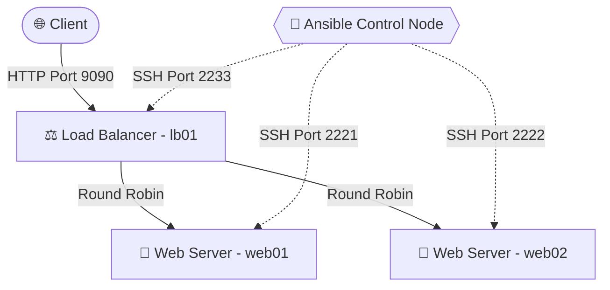

# 🚀 Automated Web Cluster with Ansible & Docker

## 📋 Project Overview
This project demonstrates **Infrastructure as Code (IaC)** by automating the provisioning and configuration of a load-balanced web server cluster. It uses **Docker** to simulate the infrastructure nodes and **Ansible** to configure Nginx web servers and a Load Balancer, ensuring high availability and seamless request routing.

## 🏗️ System Architecture

📂 Directory Structure
ansible-web-cluster/
├── docker-compose.yml     # Infrastructure setup (web01, web02, lb01)
├── inventory/
│   └── hosts.ini          # Node definitions and SSH ports
├── playbooks/
│   ├── site.yml           # Master Playbook
│   ├── deploy-web.yml     # Web server config & Nginx setup
│   └── setup-lb.yml       # Load balancer config
├── templates/
│   └── index.html.j2      # Dynamic Jinja2 web template
└── ansible.cfg            # Ansible configurations

🚀 Getting Started
1. Prerequisites
Docker & Docker Compose (with WSL2 integration enabled)

Ansible installed on the control node (WSL/Ubuntu)

2. Provision Infrastructure
Spin up the target nodes (containers) in the background:
docker-compose up -d --build

3. Deploy Configuration
Run the master playbook to configure all servers automatically:
ansible-playbook -i inventory/hosts.ini playbooks/site.yml

🧪 Testing the Cluster
Access the Load Balancer from your browser or terminal:
curl http://localhost:9090

Refresh the page multiple times to see the Load Balancer distribute traffic between web01 and web02 dynamically.

Author: Natthapon | System Integration Engineer